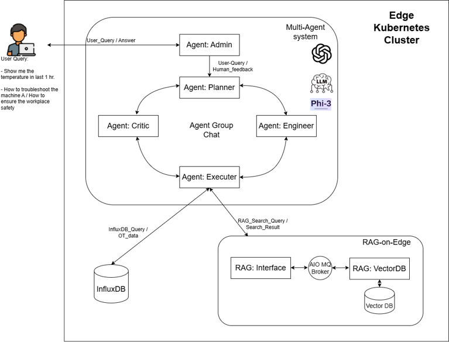

# Multi-Agent Orchestration for Industrial Edge Task Processing

A Multi-Agent system is a type of AI system composed of multiple decision-making agents that interact in a shared environment to achieve common goals.

In this solution, we are using [Microsoft AutoGen](https://microsoft.github.io/autogen/) to build Multi-Agent application to orchestrate the edge processing for two types of tasks. One task involves querying OT data from the local InfluxDB using natural language input from the user and performing analysis. Another task is to provide professional suggestions or business advice based on specific documents, such as machine troubleshooting manuals or business handbooks.

The solution can run entirely on the edge in an offline mode with a custom local LLM, such as the [Phi3](https://azure.microsoft.com/en-us/blog/introducing-phi-3-redefining-whats-possible-with-slms/) model in our example, or in hybrid mode with a cloud-based LLM, such as the GPT model in our example. It operates in an industrial [Azure Arc-enabled kubernetes](https://learn.microsoft.com/en-us/azure/azure-arc/kubernetes/overview) environment with [Azure IoT Operations (AIO)](https://azure.microsoft.com/en-us/products/iot-operations) stack suite and [RAG on Edge application](https://github.com/Azure-Samples/azure-edge-extensions-retrieval-augmented-generation).

For a quick view of how it works, check out the [demo video](#demo-video).

## Architecture



The architecture consists of 2 main components:

- Multi-Agent Component
- Task Pipelines
  - InfluxDB
  - [RAG-on-Edge Application](https://github.com/Azure-Samples/azure-edge-extensions-retrieval-augmented-generation)

### Multi-Agent Component

The Multi-Agent module receives user queries from the web application. Once the agent Admin receives a query, it passes the query to all agents to initiate a chat. The agent Planner classifies the task type, determining whether it is an OT data query and analysis task or a document search and retrieval task. The Planner then creates a step-by-step plan to accomplish the task. The agent Engineer follows the approved plan to write code, and the agent Executer executes the code to retrieve relevant information. Finally, the agent Critic reviews and provides feedback throughout the process, wrapping up the retrieved information to answer the user's question.

If you enable Human-in-the-loop, the agent Admin will seek human approval or feedback before executing the plan proposed by the Planner. The plan can be modified based on human feedback. Once the plan is approved and the agent Engineer writes the code, the agent Admin will again seek human approval or rejection before executing the code.

If you prefer to execute custom code for a specific task instead of relying on code generated by the LLM-based agent, you can pre-register the custom function with an agent. The agent will then call the registered function for the task.

This approach allows users to control the process by involving them in decision-making, providing feedback to the AI agents, and constraining the agent to use only custom function calls. It helps prevent potential security risks associated with executing unwanted code that could have negative impacts.

### Task Pipelines

In this sample, we have 2 task processes:

- Query OT data from the local influxDB
- Document retrieval from the edge vector DB.

For querying OT data from InfluxDB, we have deployed InfluxDB at the edge to store the OT data. The data can be directly queried from the InfluxDB pod using InfluxDB's query language.

For document retrieval from the edge vector DB, we have deployed the RAG-on-Edge application at the edge. This application is responsible for indexing, embedding  documents into the local vector DB, and retrieving the content via vector search. It also provides URL endpoints for the Multi-Agent component to interact with.

It's worth mentioning that in this sample we are using the [RAG-on-Edge Application](https://github.com/Azure-Samples/azure-edge-extensions-retrieval-augmented-generation) we previously designed. All RAG modules orchestrate messages with a pub/sub messaging pattern using the Azure IoT Operation MQ broker. This structure helps decouple the components in RAG, making it easy to remove or add additional components and thus easy to integrate into this Multi-Agent solution.

## Demo Video

[Demo video link](https://microsoftapc-my.sharepoint.com/:v:/g/personal/chencheng_microsoft_com/Ee0tsXrj_SNJjoHR-mXJ5KEBgsAM8yPmqLFGxllZ2W3Jow?e=RLUD5M&nav=eyJyZWZlcnJhbEluZm8iOnsicmVmZXJyYWxBcHAiOiJTdHJlYW1XZWJBcHAiLCJyZWZlcnJhbFZpZXciOiJTaGFyZURpYWxvZy1MaW5rIiwicmVmZXJyYWxBcHBQbGF0Zm9ybSI6IldlYiIsInJlZmVycmFsTW9kZSI6InZpZXcifX0%3D)

## Getting Started

### Prerequisites

- An Azure subscription. If you don't have an Azure subscription, create a [free account](https://azure.microsoft.com/en-us/free/?WT.mc_id=A261C142F) before you begin.
- An Azure Container Registry.
- An Azure VM Ubuntu

### Installation

- Install K3S cluster on the VM. Follow the steps in [Deploying K3S Cluster to Ubuntu](https://docs.k3s.io/quick-start).

### Quick Start

1. Download the repo to your local dev machine.

      ```bash
      git clone <repo url>
      ```

2. Download your large/small language model, or use phi3-mini as in our sample, and put the model files to the folder `./src/local-llm-server/models/phi3-mini`. Follow the steps in [local-llm-server/README](./src/local-llm-server/README.md).

3. Deploy InfluxDB to the VM.

      ```bash
      kubectl apply -f ./deploy/yaml/influxdb.yaml
      ```

    For demo purpose, prepare some data points in csv file and save the data to the InfluxDB via `./src/write_data_to_influxdb.py`.

4. Containerize and deploy the RAG-on-Edge components in `./src` folder: rag-on-edge-web, rag-on-edge-interface, rag-on-edge-vectorDB to the VM. You may refer to the steps in [azure-edge-extensions-retrieval-augmented-generation](https://github.com/Azure-Samples/azure-edge-extensions-retrieval-augmented-generation).

5. Containerize `./src/local-llm-server` and `./src/multi-agents` modules from the Dockerfile in the respective component folder.

    ```bash
    cd src/local-llm-server
    docker build -t <ACR_HOST>/local-llm-server:latest .
    
    cd src/multi-agents/modules/multiagents
    docker build -t <ACR_HOST>/multi-agents:latest .
    ```

    You need to set the configuration before containerizing the modules, check the details from the the READMEs in the respective component folder.

    - [local-llm-server README](./src/local-llm-server/README.md)
    - [multi-agents README](./src/multi-agents/README.md)

6. Login your Azure container registry and push the container images to your registry:

    ```bash
    docker push <ACR_HOST>/local-llm-server:latest
    docker push <ACR_HOS>/multi-agents:latest
    ```

7. Now you can open up the web UI in your local develop machine browser via configuring [port-forwarding](https://kubernetes.io/docs/tasks/access-application-cluster/port-forward-access-application-cluster/#forward-a-local-port-to-a-port-on-the-pod) on the VM that has your multi-agent components running. The web UI is accessible via `http://<VM public ip address>:8501`.

8. For demo purpose, you may pre-indexing a pdf document to the local VDB. Navigate to the webpage "Create Index" and "Upload Data"
    - page-create-index: Input a new index name and create a new index in the vector database.
    - page-upload-data: Select a pdf file from the local file system and upload the pdf file to the vectorDB. The file will be chunking and embedding into the vectorDB.

9. Navigate to the webpage "Multi-Agent Application". Select the language model in the select box. Select an index name if you want to do a document search, otherwise leave the index name box to "NA". Input the query string in the chat box and "Submit" to trigger the multi-agent application. In a while, you will see the final response on the chat box. Check out [demo video](#demo-video) for a quick view of how it works.

## Resources

- [Retrieval Augmented Generation on Edge](https://github.com/Azure-Samples/azure-edge-extensions-retrieval-augmented-generation)
- [Vector Data Deployment to Multiple Edge Vector DBs](https://github.com/Azure-Samples/azure-edge-extensions-vector-data-deployment)
